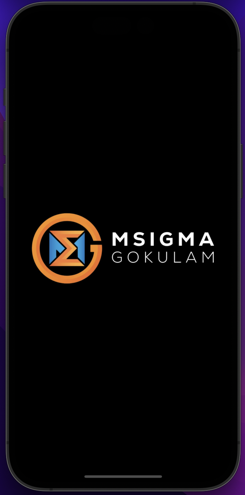
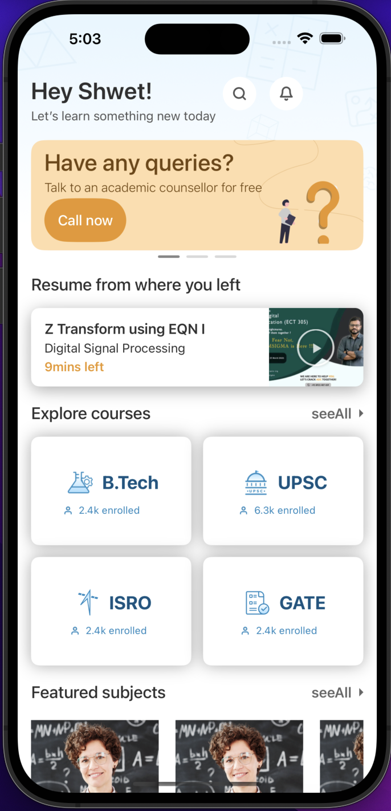
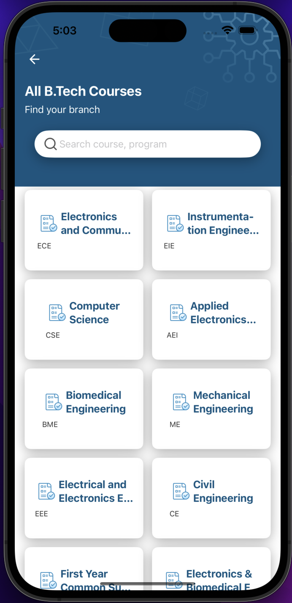

# Msigma

## App SnapShots

| Launch | Home | Courses |
| -- | -- | -- |
|  |  |  

## Overview

Msigma is an innovative online education platform crafted to simplify and enhance your learning journey. This platform offers a seamless experience for accessing and navigating diverse courses..

## Tech Stack

- Xcode 15 beta 8
- macOS Ventura 13.5
- iOS 16
- Swift 5.9
- SwiftUI

### Architecture

- Msigma follows the MVVM (Model-View-ViewModel) architecture, ensuring a clean and maintainable codebase.

### Customizations

- I've implemented a modern async/await-based URLSession APIClient inspired by Moya for efficient and clean network requests using URLSession.
  
## Getting Started

To get started with Msigma, follow these simple steps:

1. Clone the project from the provided GitHub repository.

2. Open the project in Xcode.

3. Build and run the app on your iOS device or simulator.

## Support and Contact

If you have any questions or need assistance, please contact ganeshrajugalla@gmail.com.

I hope you enjoy using Msigma and find it a valuable courses to upskill yourself. Happy learning!
